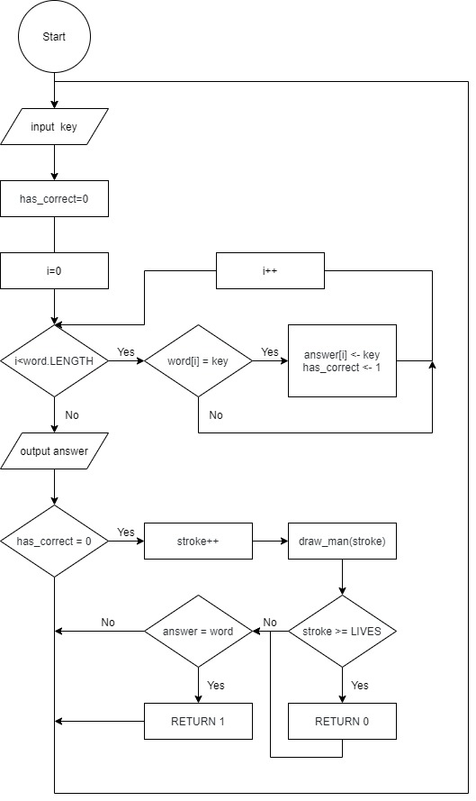
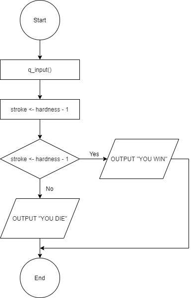

# Hanged Man Game
_By DP1-1 Rifile, Eric, Noel, Leo_

- [Hanged Man Game](#hanged-man-game)
  - [Introduction](#introduction)
  - [Structure](#structure)
  - [Flowchart](#flowchart)
      - [main](#main)
      - [init](#init)
      - [run](#run)
      - [q_input](#qinput)
      - [a_input](#ainput)
      - [draw_man](#drawman)
  - [Pseudocode](#pseudocode)
      - [main](#main-1)
      - [init](#init-1)
      - [run](#run-1)
      - [q_input](#qinput-1)
      - [a_input](#ainput-1)
      - [draw_man](#drawman-1)
  - [C++ implementation](#c-implementation)
      - [hanged_man.h](#hangedmanh)
      - [main.cpp](#maincpp)
      - [init.cpp](#initcpp)
      - [run.cpp](#runcpp)
      - [a_input.cpp](#ainputcpp)
      - [q_input.cpp](#qinputcpp)
      - [rst_input.cpp](#rstinputcpp)
      - [draw_man.cpp](#drawmancpp)
      - [win.cpp](#wincpp)
      - [die.cpp](#diecpp)
      - [del.cpp](#delcpp)
      - [init_free_str.cpp](#initfreestrcpp)
      - [strcomp.cpp](#strcompcpp)
  - [Testing](#testing)
      - [Player 1 input hardness, word, and hint](#player-1-input-hardness-word-and-hint)
      - [Player 2 input answer](#player-2-input-answer)
      - [Player 2 pass away](#player-2-pass-away)
      - [Quit or restart](#quit-or-restart)
      - [Player 2 survive](#player-2-survive)


## Introduction
Hanged Man is a game. One player enter the hardness, word, and hint, another player try characters and if the character he / she input is in the word, all same characters in the word would appear; if the character is NOT in the word, a stroke is added to a hanged man. When all the characters are tried out, player 2 win; when the hanged man are completely drawn, player 2 die.

In our design, we set the relationship of hardness and uncomplete stroke as:
| Hardness | # Uncomplete strokes |
| --- | --- |
| SIMPLE | 10 |
| MIDDLE | 9 |
| HARD | 8 |

We set the maximum number of characters of word is 20  
We set the maximum number of characters of hint is 100

All the works of this project are uploaded to github repository [https://github.com/EricEricEricJin/Hanged-Man-Game.git](https://github.com/EricEricEricJin/Hanged-Man-Game.git)

## Structure
We used top-down design in our project. Here's the structure chart.

<!--Change to draw.io version later-->

## Flowchart
#### main

#### init

#### run

#### q_input

#### a_input

#### draw_man

## Pseudocode
#### main
```
initialize()
run()
```

#### init
```
PROC initialize ()
    DECLARE word: STRING
    DECLARE hint: STRING
    DECLARE hardness: INTEGER
    DECLARE stroke: INTEGER
    DECLARE answer: STRING
    
    word <- ""
    hint <- ""
    hardness <- 0
    stroke <- 0
    answer <- ""
ENDPROC
```
#### run
```
PROC run()
    q_input()
    stroke <- hardness - 1
    IF a_input() = 1 THEN
        OUTPUT "YOU WIN"
    ELSE
        OUTPUT "YOU DIE"
    ENDIF
ENDPROC
```

#### q_input
```
PROC q_input()
    INPUT hardness "Please input the hardness"
    INPUT word "Please input the guessing word"
    INPUT hint "Please input the hint"
ENDPROC
```

#### a_input
```
PROC a_input()
    DECLEAR key: CHARACTER
    DECLEAR i: INTEGER
    DECLEAR has_correct: BOOLEN
    key <- ""

    WHILE
        INPUT key
        has_correct <- 0
        FOR i <- 0 TO word.LENGTH
            IF word[i] = key THEN
                answer[i] <- key
                has_correct <- 1
            ENDIF
        ENDFOR
        OUTPUT answer
        IF has_correct = 0 THEN
            stroke <- stroke + 1
            draw_man(stroke)
            IF stroke >= LIVES THEN
                // loose
                RETURN 0;
            ENDIF
        ELIF answer = word THEN
            // win
            RETURN 1;
        ENDIF
    ENDWHILE
ENDPROC
```

#### draw_man
```
PROC draw_man()
    IF stroke == 0 THEN
        OUTPUT 
            "
                

                


                
            "

    ELIF stroke == 1 THEN
        OUTPUT 
            "
                


                

                ********
            "

    ELIF stroke == 2 THEN
        OUTPUT 
            "
                *
                *
                *
                *
                *
                *
                *
                ********
            "

    ELIF stroke == 3 THEN
        OUTPUT 
            "
                *****
                *
                *
                *
                *
                *
                *
                ********
            "

    ELIF stroke == 4 THEN
        OUTPUT 
            "
                *****
                *   *
                *
                *
                *
                *
                *
                ********
            "

    ELIF stroke == 5 THEN
        OUTPUT 
            "
                *****
                *   *
                *  * *
                *   *
                *
                *
                *
                ********
            "

    ELIF stroke == 6 THEN
        OUTPUT 
            "
                *****
                *   *
                *  * *
                *   *
                *   *
                *   *
                *
                ********
            "
    ELIF stroke == 7 THEN
        OUTPUT
            "
                *****
                *   *
                *  * *
                *   *
                *  **
                *   *
                *
                ********
            "
    ELIF stroke == 8 THEN
        OUTPUT
            "
                *****
                *   *
                *  * *
                *   *
                *  ***
                *   *
                *
                ********
            "

    ELIF stroke == 9 THEN
        OUTPUT
            "
                *****
                *   *
                *  * *
                *   *
                *  ***
                *   *
                *  *
                ********
            "   

    ELIF stroke == 10 THEN
        OUTPUT
            "
                *****
                *   *
                *  * *
                *   *
                *  ***
                *   *
                *  * *
                ********
            "    
    ENDIF
ENDPROC
```

## C++ implementation
#### hanged_man.h
```cpp
#ifndef _H_M__
#define _H_M__

#define WINDOW_H 24
#define WINDOW_W 80

#define WORD_MAX_LEN 20
#define HINT_MAX_LEN 100

#define LIVES 10

#include <cstdio>
#include <cstdlib>
#include <curses.h>

struct string {
    char* text;
    int len;
};

class hangedMan {
    private:
        WINDOW* main_win;
        WINDOW* man_win;
        WINDOW* IO_win;

        int q_input_stage;
        int hardness;
        string* hint;
        string* word;
        string* answer;

        int stroke;

        
        int restart;

        void draw_man();
        int q_input(int key_val);
        int a_input(int key_val);
        int strcomp(char* s1, char* s2, int len);
        void die();
        void win();
        void del();
        int rst_input(int key_val);
        string* init_str(int len, char chr);
        void free_str(string* str);

    public:
        hangedMan();
        void run();

};
#endif
```

#### main.cpp
```cpp
#include "hanged_man.h"

using namespace std;
int main() {
    hangedMan H;
    H.run();
}
```

#### init.cpp
```cpp
/**
 * Function: init
 * Description: initialize as the class is instantiated
 * Parameter: None
 * Return: None
*/

#include "hanged_man.h"

hangedMan::hangedMan() {
    main_win = initscr();
    man_win = subwin(main_win, LINES, int(COLS / 2), 0, int(COLS / 2));
    IO_win = subwin(main_win, LINES, int(COLS / 2), 0, 0);
    // cbreak();
    noecho();
}
```

#### run.cpp
```cpp
/**
 * Function: run
 * Description: the main loop of the game
 * Parameter: None
 * Return: None
*/

#include "hanged_man.h"

void hangedMan::run() {
    word = init_str(WORD_MAX_LEN, 0);
    hint = init_str(HINT_MAX_LEN, 0);
    q_input_stage = 0;
    hardness = 0;
    stroke = 0;
    restart = 0;
    
    wclear(main_win);
    wclear(man_win);
    wclear(IO_win);

    box(main_win, ACS_VLINE, ACS_HLINE);

    int key_val = 0;
    q_input_stage = 0;
    while (1) {
        
        if (q_input(key_val) == 1) {
            break;
        }
        key_val = getch();
    }
    
    wclear(main_win);
    box(main_win, ACS_VLINE, ACS_HLINE);
    box(man_win, ACS_VLINE, ACS_HLINE);
    box(IO_win, ACS_VLINE, ACS_HLINE);

    stroke += hardness - 1;
    answer = init_str(word -> len, 95);

    wprintw(IO_win, answer -> text);
    key_val = 0;

    int brk = 0;
    while (1) {
        if (brk == 1) {
            break;
        }
        switch (a_input(key_val)) {
            case 1:
                win();
                brk = 1;
                break;
            case -1:
                brk = 1;
                die();
                break;
            default:
                key_val = getch();
                break;
        }
    }

    // restart or quit
    getch();
    key_val = 0;
    restart = 0;
    while (1) {
        if (rst_input(key_val) == 1) {
            if (restart == 0) {
                del();
            } else if (restart == 1) {
                del();
                run();
            }
            break;
        }
        key_val = getch();
    }
}
```

#### a_input.cpp
```cpp
/**
 * Function: a_input
 * Description: the player input the answer
 * Parameter: key_val
 * Return: die(-1) or win(1) or unfinished(0)
*/

#include "hanged_man.h"

int hangedMan::a_input(int key_val) {
    if (key_val != 0) {
        int hasCorrect = 0;
        for (int i = 0; i < word -> len; i++) {
            if (*(word -> text + i) == key_val) {
                hasCorrect = 1;
                *(answer -> text + i) = key_val;
            }
        }
        
        if (hasCorrect == 0) {
            stroke += 1;
        }
    }
    wclear(IO_win);
    box(IO_win, ACS_VLINE, ACS_HLINE);
    wmove(IO_win, int(LINES / 2), 5);
    wprintw(IO_win, answer -> text);
    wmove(IO_win, int(LINES / 2) + 2, 5);
    wprintw(IO_win, "Hint:");
    wmove(IO_win, int(LINES / 2) + 3, 5);
    wprintw(IO_win, hint -> text);
    wrefresh(IO_win);
    draw_man();
    
    if (stroke >= 10) {
        // dead
        return -1;
    } else if (strcomp(answer -> text, word -> text, word -> len) == 1) {
        return 1;
    }
    return 0;
}
```

#### q_input.cpp
```cpp
/**
 * Function: q_input
 * Description: input of question
 * Parameter: key_val
 * Return: 0 not decide or 1 decided
*/

#include "hanged_man.h"

int hangedMan::q_input(int key_val) {
    wclear(main_win);
    box(main_win, ACS_VLINE, ACS_HLINE);
    if (key_val == 9) {
        q_input_stage += 1;
        if (q_input_stage > 3) {
            q_input_stage = 0;
        }
    } else {
        switch (q_input_stage) {
            case 0: // hardness
                switch (key_val) {
                    case 49:
                        hardness = 1;
                        break;
                    case 50:
                        hardness = 2;
                        break;
                    case 51:
                        hardness = 3;
                        break;
                }
                break;
            
            case 1: // word
                if (key_val >= 97 && key_val <= 122) {
                    if (word -> len < WORD_MAX_LEN) {
                        *(word -> text + word -> len) = key_val;
                        word -> len += 1;
                    }
                } else if (key_val == 127) { // delete
                    if (word -> len > 0) {
                        *(word -> text + word -> len - 1) = 0;
                        word -> len -= 1;
                    }
                }
                break;

            case 2: // Hint
                if (key_val >= 97 && key_val <= 122) {
                    if (hint -> len < HINT_MAX_LEN) {
                        *(hint -> text + hint -> len) = key_val;
                        hint -> len += 1;
                    }
                } else if (key_val == 127) { // delete
                    if (hint -> len > 0) {
                        *(hint -> text + hint -> len - 1) = 0;
                        hint -> len -= 1;
                    }
                }
                break;

            case 3:
                if (key_val == 10) {
                    return 1;
                }

            default:
                break;
        }
    }

    // show
    wmove(main_win, 1, 10);
    wprintw(main_win, "Hardness");

    wmove(main_win, 2, 10);
    switch (hardness) {
        case 1:
            wprintw(main_win, "SIMPLE");
            break;
        case 2:
            wprintw(main_win, "MIDDLE");
            break;
        case 3:
            wprintw(main_win, "HARD");
            break;
        default:
            break;
    }
    
    wmove(main_win, 3, 10);
    wprintw(main_win, "Word");

    wmove(main_win, 4, 10);
    wprintw(main_win, word -> text);

    wmove(main_win, 5, 10);
    wprintw(main_win, "Hint");

    wmove(main_win, 6, 10);
    wprintw(main_win, hint -> text);

    wmove(main_win, 7, 10);
    wprintw(main_win, "Finish");

    wmove(main_win, int(q_input_stage * 2 + 1), 1);
    wprintw(main_win, "->");
    return 0;
}
```

#### rst_input.cpp
```cpp
/**
 * Function: rst_input
 * Description: get user's restart or quit input after game end
 * Parameter: key_val
 * Return: 0: not decide, 1: decided
*/

#include "hanged_man.h"

int hangedMan::rst_input(int key_val) {
    int rt = 0;
    switch (key_val) {
        case 9:
            restart += 1;
            if (restart > 1) {
                restart = 0;
            }
            rt = 0;
            break;
        case 10:
            rt = 1;
            break;
        default:
            rt = 0;
            break;
    }

    wclear(main_win);
    wmove(main_win, int(LINES / 2) + 5, int(COLS / 2));
    wprintw(main_win, "RESTART");
    wmove(main_win, int(LINES / 2) + 6, int(COLS / 2));
    wprintw(main_win, "QUIT");
    wmove(main_win, int(LINES / 2) + 6 - restart, int(COLS / 2) - 5);
    wprintw(main_win, "-->");
    wrefresh(main_win);

    return rt;
}
```

#### draw_man.cpp
```cpp
/**
 * Function: draw_man
 * Description: draw the man
 * Parameter: None
 * Return: None
*/

#include "hanged_man.h"

void hangedMan::draw_man() {
    wclear(man_win);
    box(man_win, ACS_VLINE, ACS_HLINE);
    // wprintw(man_win, "%d", stroke);
    int counter = 0;
    if (counter >= stroke) {
        wrefresh(man_win);
        return;
    }

    wmove(man_win, LINES - 5, 5);
    whline(man_win, 42, 10);

    counter += 1;
    if (counter >= stroke) {
        wrefresh(man_win);
        return;
    }
    
    wmove(man_win, 5, 5);
    wvline(man_win, 42, (LINES - 10));

    counter += 1;
    if (counter >= stroke) {
        wrefresh(man_win);
        return;
    }

    whline(man_win, 42, 8);

    counter += 1;
    if (counter >= stroke) {
        wrefresh(man_win);
        return;
    }

    wmove(man_win, 5, 13);
    wvline(man_win, 42, 4);

    counter += 1;
    if (counter >= stroke) {
        wrefresh(man_win);
        return;
    }

    wmove(man_win, 7, 12);
    whline(man_win, 42, 3);
    wvline(man_win, 42, 3);
    wmove(man_win, 9, 12);
    whline(man_win, 42, 3);
    wmove(man_win, 7, 14);
    wvline(man_win, 42, 3);


    counter += 1;
    if (counter >= stroke) {
        wrefresh(man_win);
        return;
    }

    wmove(man_win, 8, 13);
    wvline(man_win, 42, 4);


    counter += 1;
    if (counter >= stroke) {
        wrefresh(man_win);
        return;
    }
    
    wmove(man_win, 10, 10);
    whline(man_win, 42, 3);

    counter += 1;
    if (counter >= stroke) {
        wrefresh(man_win);
        return;
    }

    wmove(man_win, 10, 13);
    whline(man_win, 42, 4);

    counter += 1;
    if (counter >= stroke) {
        wrefresh(man_win);
        return;
    }

    wmove(man_win, 12, 12);
    wvline(man_win, 42, 2);

    counter += 1;
    if (counter >= stroke) {
        wrefresh(man_win);
        return;
    }

    wmove(man_win, 12, 14);
    wvline(man_win, 42, 2);
    counter += 1;
    if (counter >= stroke) {
        wrefresh(man_win);
        return;
    }
}
```

#### win.cpp
```cpp
/**
 * Function: win
 * Description: called after player2 win
 * Parameter: None
 * Return: None
*/

#include "hanged_man.h"

void hangedMan::win() {
    wclear(main_win);
    wmove(main_win, int(LINES / 2), int(COLS / 2) - 5);
    wprintw(main_win, "YOU WIN");
    box(main_win, ACS_VLINE, ACS_HLINE);
    wrefresh(main_win);
}
```

#### die.cpp
```cpp
/**
 * Function: die
 * Description: what to do after die
 * Parameter: None
 * Return: None
*/

#include "hanged_man.h"

void hangedMan::die() {
    wclear(IO_win);
    wmove(IO_win, int(LINES / 2), int(COLS / 4));
    wprintw(IO_win, "YOU DIE!");
    
    stroke = 5;
    draw_man();

    wmove(man_win, 13, 13);
    wvline(man_win, 42, 4);

    
    wmove(man_win, 15, 10);
    whline(man_win, 42, 3);


    wmove(man_win, 15, 13);
    whline(man_win, 42, 4);


    wmove(man_win, 17, 12);
    wvline(man_win, 42, 2);

    wmove(man_win, 17, 14);
    wvline(man_win, 42, 2);
    
    box(IO_win, ACS_VLINE, ACS_HLINE);
    wrefresh(man_win);
    wrefresh(IO_win);
}
```
#### del.cpp
```cpp
/**
 * Function: del
 * Description: free the allocated memory
 * Parameter: None
 * Return: None
*/

#include "hanged_man.h"

void hangedMan::del() {
    endwin();
    free_str(word);
    free_str(hint);
    free_str(answer);
}
```

#### init_free_str.cpp
```cpp
#include "hanged_man.h"

/**
 * Function: init_str
 * Description: initizlize a string structure
 * Parameter: string max length, initialize character
 * Return: string* of the string.
*/
string* hangedMan::init_str(int len, char chr) {
    string* str;
    str = (string*)malloc(sizeof(string));
    str -> text = (char*)malloc(sizeof(char) * len);
    for (int i = 0; i < len; i++) {
        *(str -> text + i) = chr;
    }
    str -> len = 0;
    return str;
}

/**
 * Function: free_str
 * Description: free the string structure
 * Parameter: string* string
 * Return: None
*/
void hangedMan::free_str(string* str) {
    free(str -> text);
    free(str);
}
```

#### strcomp.cpp
```cpp
/**
 * Function: strcomp
 * Description: use to compare two string which have same length
 * Parameter: string1, string2, length
 * Return: 0 not smae or 1 same
*/

#include "hanged_man.h"

int hangedMan::strcomp(char* s1, char* s2, int len) {
    int same = 1;
    for (int i = 0; i < len; i++) {
        if (*(s1 + i) != *(s2 + i)) {
            same = 0;
        }
    }
    return same;
}
```

## Testing

We compile the C++ program with makefile
```makefile
main:
	g++ -o hanged_man.out main.cpp init.cpp run.cpp draw_man.cpp a_input.cpp q_input.cpp strcomp.cpp die.cpp win.cpp del.cpp rst_input.cpp init_free_str.cpp -l curses
```
in Mac OS X 10.15 with g++ version 4.2.1 and curses lib installed. We run it in terminal window of size 80 cols 24 rows.

#### Player 1 input hardness, word, and hint


#### Player 2 input answer


#### Player 2 pass away


#### Quit or restart


#### Player 2 survive


